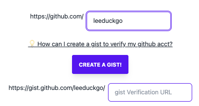
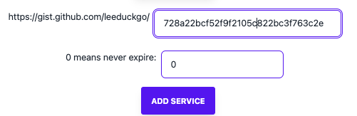

# How to bind the github account with MoveDID?

**Step 0x01 ) Open MoveDID Manager**

> https://manager.movedid.build

**Step 0x02 ) Connect the wallet**

**Step 0x03 ) Enter your github account**

**Step 0x04 ) Creat a gist**

> https://gist.github.com/

Copy your address to the file content.

> 💡Remember! to `Create public gist`!

**Step 0x05 ) Copy the hash, paste it into the manager**

Copy the hash from url.

Copy it into manager.

**Step 0x06 ) Click `ADD SERVICE`!**

**Step 0x07 ) See your github in the panel of index**

 

If there is not, click the `REFRESH THE SERVICES INFO` to refresh the page.

**Step 0x08 ) Load to modify the item**

If you would like to modify the item, you could click the `LOAD` button, then modify the fields which you like, then click the `UPDATE SERVICE` button

**Step 0x09 ) Delete item**

if you would like to delete the item, you could click the `DELETE SERVICE` button.
